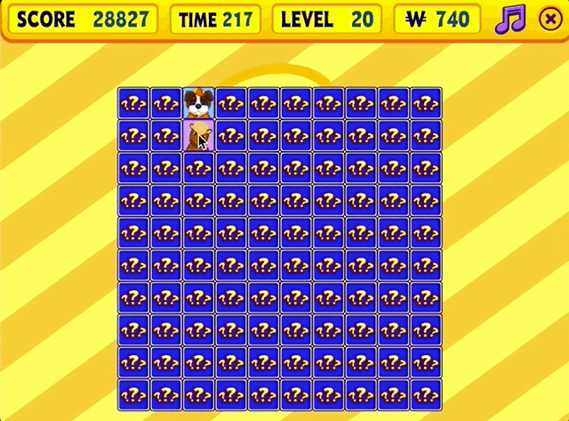

# Webkinz Game Bots
## Bot List
### Lunch Letters

### Where's Wacky

### Operation Gumball

### Atlantiles

### Booger Gets an A

### Goober's Lab

### Picnic

### Wacky Zingos

## Instructions
1. Clone the code to your machine: `git clone https://github.com/darcipeoples/webkinz-game-bots.git`
2. Launch Webkinz, open to your game of choice, and put the Webkinz window at the top left of your screen.
3. Follow the instructions for running your bot of choice in the `README.md` of the corresponding folder.

## TODOs
- Utils
  - Make a way for people to test if their window is in the right place before running
  - Make util for parsing numbers
- Add to website
- Record long playthroughs / video
- Figure out requirements.txt
  - Ensure a fresh clone/install works
- Ensure Windows compatibility